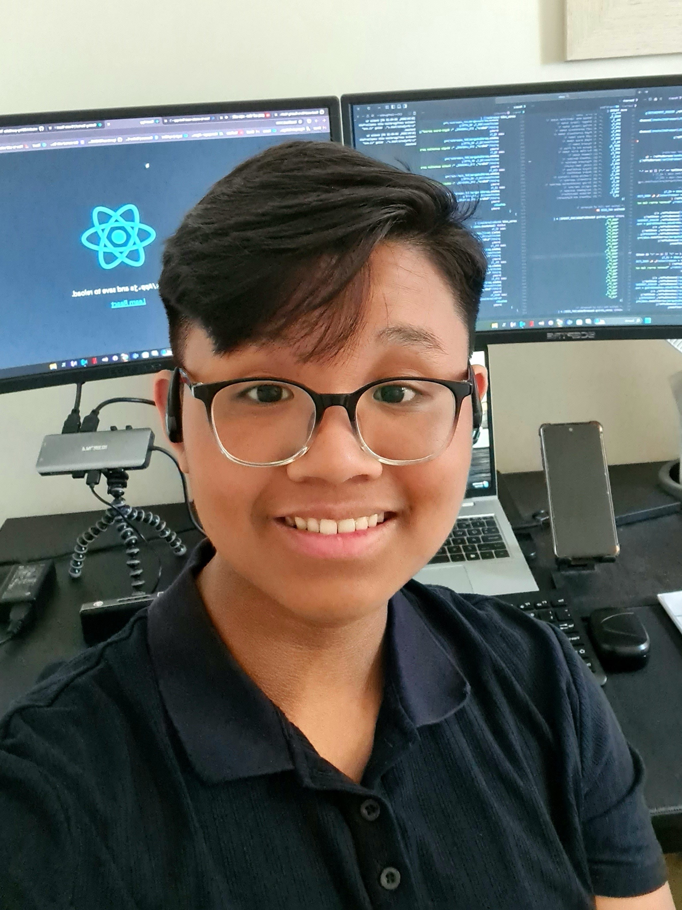
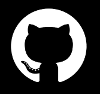
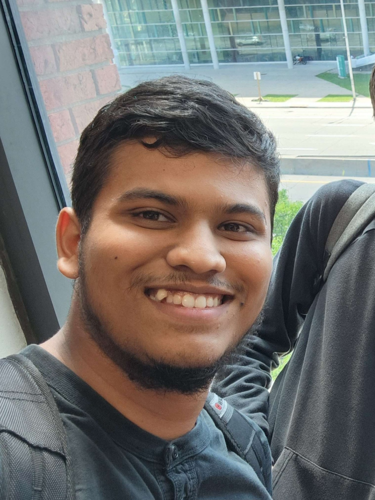
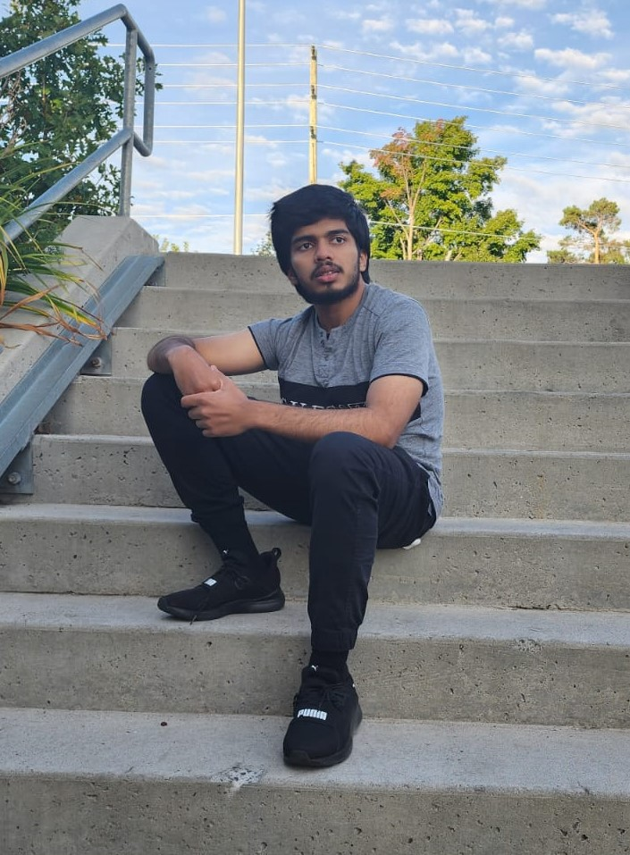
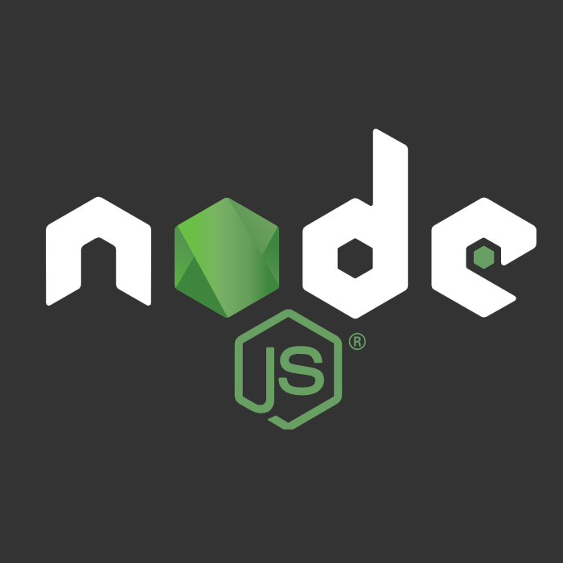

<h2 align="center">Hey @github users 😎</h2>


## 🤔 Who, What, When, Where?</h2>
We are from different countries but united by thoughts. Consider ourselves as:
- Works 25 hours/ day
- Engineer stress
- Commit without review

Our program can detect blood clotting, high blood pressure, and glucose level, etc. 🐐


### Where are we ? Planet Earth 🌍

<br>

<h2 align="center"> How to consider a good programmer? </h2>
<div align="center">

```
If it works, don't touch it
-- SeniorW team --
```
</div>

<br>

<h2 align="center"> Dev Team </h2>

<table align="center">
  <!-- Yen -->
  <tr>
    <td></td>
    <td>
      <h1>Yen Huynh</h1>
      <h3>Full Stack & Software Developer </h3>
      <a href="https://github.com/YenHuynh02"></a> &nbsp
      <a href="https://www.linkedin.com/in/yen-huynh-pp12"></a>
    </td>
  </tr>

  <!-- Peyton -->
  <tr>
    <td>
      <h1>Peyton Da Silva</h1>
      <h3>Project Management & Full Stack Developer</h3>
      <a href="https://github.com/PalpaWalker"></a> &nbsp
      <a href="https://www.linkedin.com/in/peyton-da-silva-404369258"></a>
      </td>
    <td></td>
  </tr>

  <!-- Mohammed -->
  <tr>
    <td></td>
    <td>
      <h1>Mohammed Muhsin Shaik</h1>
      <h3>Full Stack Developer</h3>
      <a href="https://github.com/muhsin308"></a> &nbsp
      <a href="https://www.linkedin.com/in/shaik-mohammed-muhsin-5451a5226"></a>
    </td>
  </tr>

  <!-- Muntasir -->
  <tr>
    <td>
      <h1>Muntasir Mohammed</h1>
      <h3>Full Stack & Software Designer</h3>
      <a href="https://github.com/moha0988"></a> &nbsp
      <a href="https://www.linkedin.com/in/muntasir-m-510194255"></a>
    </td>
    <td></td>
  </tr>
  
</table>

<br>

<h2 align="center">Languages and Tools</h2>
<p align="center">
   &nbsp;
   &nbsp;
   &nbsp;
   &nbsp;
   &nbsp;
   &nbsp;
   &nbsp;
   &nbsp;
   &nbsp;
   &nbsp;
   &nbsp;
   &nbsp;
</p>
