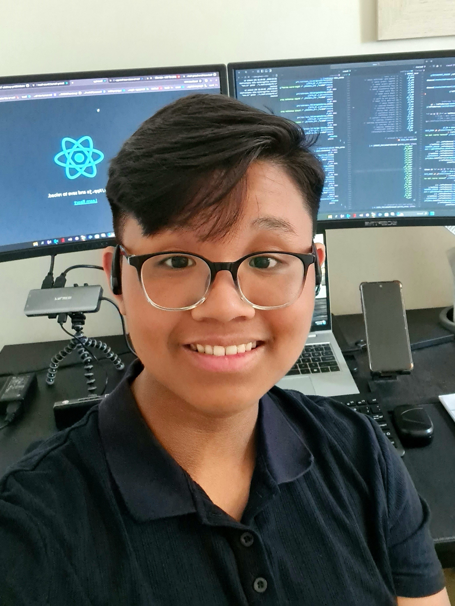

<h2 align="center">Hey @github users 😎</h2>

## 🤔 Who, What, When, Where?</h2>
We are from different countries but united by thoughts. Consider ourselves as:
- Works 25 hours/ day
- Engineer stress
- Commit without review

## How to consider a good programmer?
`If it works, don't touch it`

 

<h2 align="center"> SeniorWell's Team </h2>

<table align="center">
  <tr>
    <td align="center">Yen Huynh</td>
    <td align="center">Mohammed Muhsin Shaik</td>
    <td align="center">Peyton Da Silva</td>
    <td align="center">Muntasir Mohammed</td>
  </tr>
  <tr>
    <td align="center"></td>
    <td align="center"></td>
    <td align="center"></td>
    <td align="center"></td>
  </tr>
</table>

 

<h2 align="center">Languages and Tools</h2>

   &nbsp;
   &nbsp;
   &nbsp;
   &nbsp;
   &nbsp;

