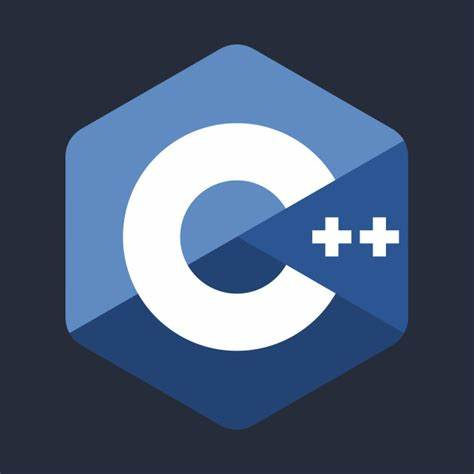

<h2 align="center">Hey @github users 😎</h2>


## 🤔 Who, What, When, Where?</h2>
We are from different countries but united by thoughts. Consider ourselves as:
- Works 25 hours/ day
- Engineer stress
- Commit without review

Our program can detect blood clotting, high blood pressure, and glucose level, etc. 🐐

```cpp
/*
  File name: Demo
  Release date: Sep 14th, 2024
*/
const int ledPin = 20;

// the setup function runs once when you press reset or power the board
void setup() {
  // initialize digital pin LED_BUILTIN as an output.
  pinMode(ledPin, OUTPUT);
}

// the loop function runs over and over again forever
void loop() {
  digitalWrite(ledPin, HIGH);  // turn the LED on (HIGH is the voltage level)
  delay(1000);                 // wait for a second
  digitalWrite(ledPin, LOW);   // turn the LED off by making the voltage LOW
  delay(1000);                 // wait for a second
}

```

### Where are we ? Planet Earth 🌍

<br>

<h2 align="center"> How to consider a good programmer? </h2>
<div align="center">

```
If it works, don't touch it
-- SeniorW team --
```
</div>

<br>

<h2 align="center"> Dev Team </h2>

<table align="center">
  <tr>
    <td align="center">Yen Huynh</td>
    <td align="center">Mohammed Muhsin Shaik</td>
    <td align="center">Peyton Da Silva</td>
    <td align="center">Muntasir Mohammed</td>
  </tr>
  <tr>
    <td align="center"></td>
    <td align="center"></td>
    <td align="center"></td>
    <td align="center"></td>
  </tr>
  <tr>
    <td align="center"><a href="https://github.com/YenHuynh02" taget='_blank'>Get in touch</a></td>
    <td align="center"><a href="https://github.com/muhsin308">Get in touch</a></td>
    <td align="center"><a href="https://github.com/PalpaWalker">Get in touch</a></td>
    <td align="center"><a href="https://github.com/moha0988">Get in touch</a></td>
  </tr>
</table>

<br>

<h2 align="center">Languages and Tools</h2>
<p align="center">
   &nbsp;
   &nbsp;
   &nbsp;
   &nbsp;
   &nbsp;
   &nbsp;
   &nbsp;
   &nbsp;
   &nbsp;
</p>
